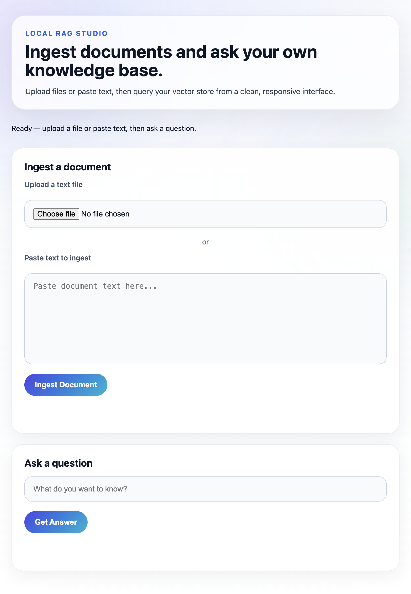

# Local RAG with LangChain & Ollama 🦙

This project now includes a production-ready FastAPI backend and a local browser frontend for ingesting text and querying your documents.

## 🏗️ Architecture Stack
* **Backend:** FastAPI
* **Frontend:** Static HTML/JavaScript served by FastAPI
* **Vector Store:** [Chroma](https://www.trychroma.com/) (local persistence)
* **Embeddings:** [HuggingFace](https://huggingface.co/) (`all-MiniLM-L6-v2`)
* **LLM:** [Llama 3](https://ai.meta.com/blog/meta-llama-3/) via [Ollama](https://ollama.com/)

---

## 🚀 Prerequisites

1. Install Ollama from [ollama.com](https://ollama.com/).
2. Pull the Llama 3 model locally:

```bash
ollama run llama3
```

3. Create and activate a Python virtual environment:

```bash
python -m venv venv
source venv/bin/activate
```

4. Install Python dependencies:

```bash
pip install -r requirements.txt
```

---

## 🖥️ Run the Local App

Start the FastAPI service from your activated virtual environment:

```bash
python3 -m uvicorn app.main:app --reload
```

Open the browser at:

```text
http://localhost:8000
```



The UI supports both pasted text ingestion and file upload ingestion, then querying the local RAG system from the same page.
Start the app and run quick tests. These exact commands work on macOS (use the
project venv so dependencies like `python-multipart` are available):

1. Create and activate a virtual environment (only if you haven't already):

```bash
python3 -m venv .venv
source .venv/bin/activate
```

2. Install requirements (includes `python-multipart`):

```bash
./.venv/bin/python3 -m pip install -r requirements.txt
```

3. Run the FastAPI server (run from the project root):

```bash
./.venv/bin/python3 -m uvicorn app.main:app --reload
```

4. Open the browser to:

```text
http://127.0.0.1:8000
```

Quick curl smoke tests (optional):

```bash
# Multipart ingest with text
curl -v -F "text=hello from curl venv test" http://127.0.0.1:8000/api/ingest

# Multipart ingest with file
curl -v -F "file=@data/sample_document.txt" http://127.0.0.1:8000/api/ingest

# Query the RAG endpoint (form field `question`)
curl -v -F "question=What is this test about?" http://127.0.0.1:8000/api/query
```

Notes:
- Always run the server with the project's venv Python (`./.venv/bin/python3`) to
	ensure the installed packages are used. Starting Uvicorn with a system
	Python that lacks `python-multipart` will raise the Form data runtime error.
- `requirements.txt` now includes `python-multipart` so future setups will
	install multipart support automatically.

---

## 🧠 CLI Usage

### Ingest a text file

```bash
python ingest.py --file data/sample_document.txt
```

Or ingest raw text directly:

```bash
python ingest.py --text "Your document text goes here."
```

### Query the local RAG system

```bash
python query.py --question "What is the document about?"
```

---

## 📂 Updated Project Structure

```text
model-rag/
├── app/
│   ├── main.py
│   ├── services/
│   │   ├── __init__.py
│   │   ├── rag_service.py
│   │   ├── settings.py
│   │   └── vector_store_service.py
│   └── static/
│       ├── app.js
│       ├── index.html
│       └── styles.css
├── data/
│   └── sample_document.txt
├── chroma_db/              # Local vector store (ignored by git)
├── ingest.py
├── query.py
├── requirments.txt
├── README.md
└── .gitignore
```
